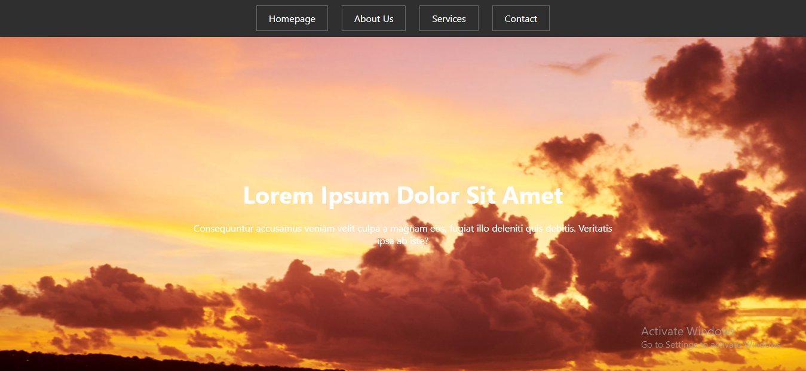
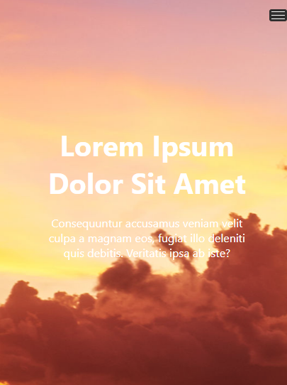

# Chingu Solo Project - Tier 1 - Website Template

This is my clone of the [Tier1 Website Template](https://www.free-css.com/assets/files/free-css-templates/preview/page196/conquer/).

## Table of contents

- [Overview](#overview)
  - [The challenge](#the-challenge)
  - [Screenshot](#screenshot)
  - [Links](#links)
- [My process](#my-process)
  - [Built with](#built-with)
- [Author](#author)

## Overview

### The challenge

Users should be able to:

- View the optimal layout for the app depending on their device's screen size
- See hover states for all interactive elements on the page

### Screenshot
#### Desktop

#### Mobile

### Links

- Live Site URL: [Advice Generator App](https://conquer-tier-1-soloproject.vercel.app/)

## My process

### Built with

- Semantic HTML5 markup
- Flexbox
- Javascript Promises

## Author

- Website - [Roni Egbu](https://ronniiii-i.github.io)
- Twitter - [@ronniiii_i](https://www.twitter.com/ronniiii_i)

